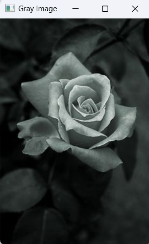
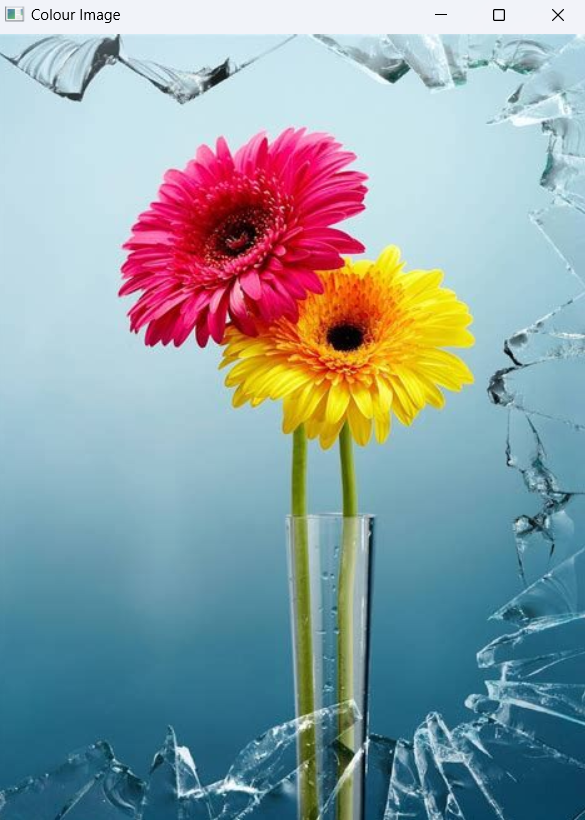
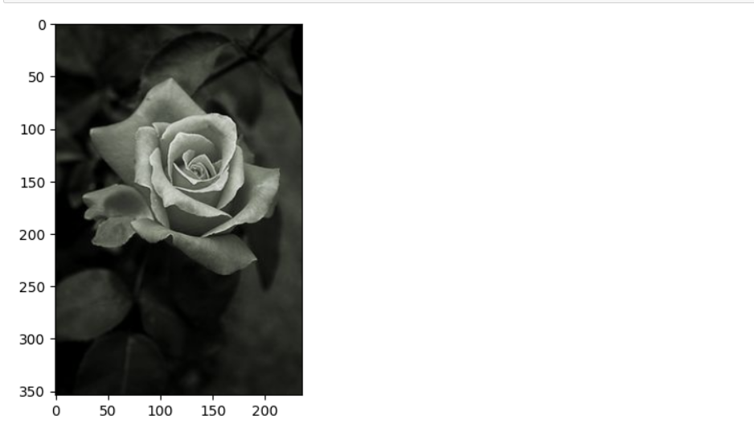
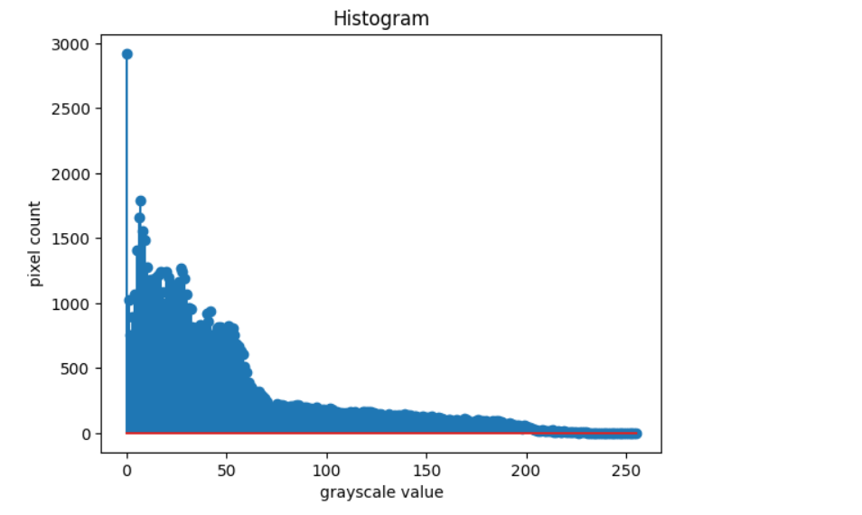
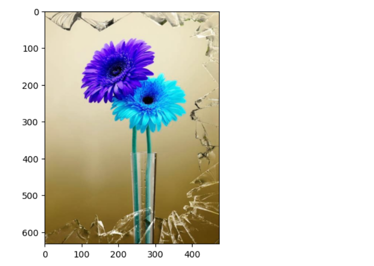
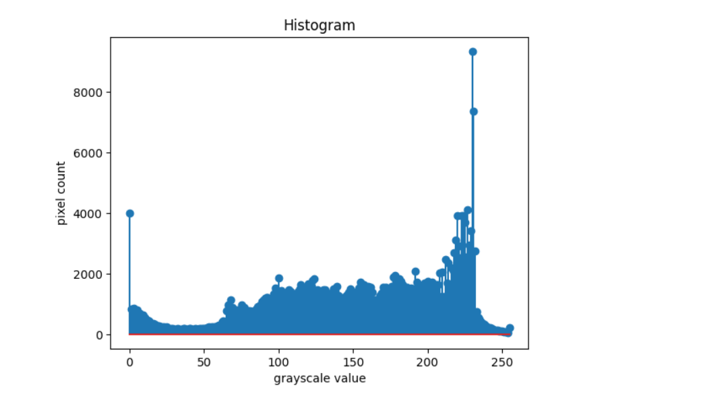
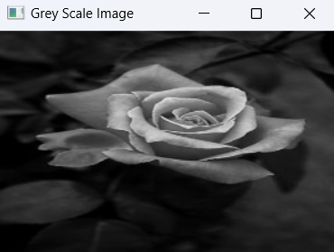
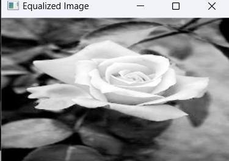

# Histogram-of-an-images
## Aim
To obtain a histogram for finding the frequency of pixels in an Image with pixel values ranging from 0 to 255. Also write the code using OpenCV to perform histogram equalization.

## Software Required:
Anaconda - Python 3.7

## Algorithm:
### Step1:
Read the gray and color image using imread()

### Step2:
Print the image using imshow().


### Step3:
Use calcHist() function to mark the image in graph frequency for gray and color image.

### step4:
Use calcHist() function to mark the image in graph frequency for gray and color image.

### Step5:
The Histogram of gray scale image and color image is shown.


## Program:
```python
# Developed By: MADHAN BABU P
# Register Number: 212222230075
```
## Gray Image and Color Image
```
import cv2
import matplotlib.pyplot as plt
gray_image = cv2.imread("b.jpg")
color_image = cv2.imread("flo.jpg",-1)
cv2.imshow("Gray Image",gray_image)
cv2.imshow("Colour Image",color_image)
cv2.waitKey(0)
cv2.destroyAllWindows()
```
## Histogram of Grayscale Image
```
import cv2
import matplotlib.pyplot as plt
gray_img = cv2.imread('b.jpg')
color_img = cv2.imread('flo.jpg')
hist = cv2.calcHist([gray_img],[0],None,[256],[0,256])
hist1 = cv2.calcHist([color_img],[1],None,[256],[0,256])
plt.figure()
plt.imshow(gray_img)
plt.show()
plt.title("Histogram")
plt.xlabel('grayscale value')
plt.ylabel('pixel count')
plt.stem(hist)
plt.show()
```
## Histogram of Color Image
```
import cv2
import matplotlib.pyplot as plt
gray_img = cv2.imread('b.jpg')
color_img = cv2.imread('flo.jpg')
hist = cv2.calcHist([gray_img],[0],None,[256],[0,256])
hist1 = cv2.calcHist([color_img],[1],None,[256],[0,256])
plt.figure()
plt.imshow(color_img)
plt.show()
plt.title("Histogram")
plt.xlabel('grayscale value')
plt.ylabel('pixel count')
plt.stem(hist1)
plt.show()
```
## Histogram Equilization of GrayScale Image
```
import cv2
gray_img = cv2.imread('b.jpg',0)
gray_img = cv2.resize(gray_img,(300,200))
cv2.imshow('Grey Scale Image',gray_img)
equ = cv2.equalizeHist(gray_img)
cv2.imshow("Equalized Image",equ)
cv2.waitKey(0)

```


## Output:
### Input Grayscale Image and Color Image




### Histogram of Grayscale Image and any channel of Color Image



### Histogram of Color Image:



### Histogram Equalization of Grayscale Image.





## Result: 
Thus the histogram for finding the frequency of pixels in an image with pixel values ranging from 0 to 255 is obtained. Also,histogram equalization is done for the gray scale image using OpenCV.
